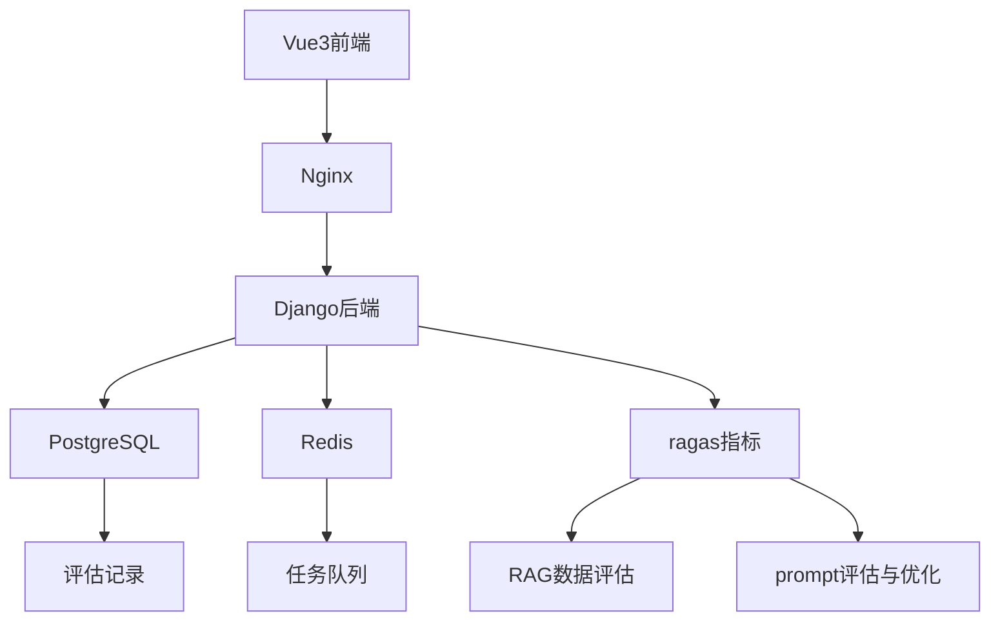
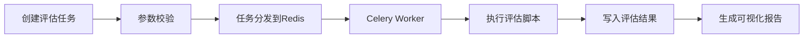

# 大模型评估平台启动文档

**项目代号**：EvalMaster  
**技术架构**：Python + Vue3 + PostgreSQL + Redis  

---

## 一、项目概述

### 1.1 核心功能

- RAG评估矩阵（准确性/时效性/相关性）  
- Prompt优化工作流（A/B测试+迭代优化）  
- 多模型对比评估（支持Qwen/通义千问等）  
- 评估报告引擎（可视化+优化建议）  

### 1.2 技术架构



---

## 二、关键技术组件

### 2.1 评估指标计算

```python
# Django评估指标示例
class Evaluation(models.Model):
    prompt = models.TextField()
    response = models.JSONField()
    metrics = models.JSONField()

    def calculate_metrics(self):
        return {
            "rag_accuracy": self._calculate_rag_accuracy(),
            "response_latency": self._measure_latency(),
            "context_relevance": self._check_relevance()
        }
```

### 2.2 评估工作流引擎



---

## 三、项目里程碑

| 阶段           | 时间窗 | 交付物             | 成功标准         |
| -------------- | ------ | ------------------ | ---------------- |
| 评估框架开发   | W1-W2  | 基础评估指标体系   | 支持5+核心指标   |
| 优化工作流开发 | W3-W4  | Prompt迭代优化模块 | 单轮优化响应≤30s |
| 多模型支持     | W5     | 适配3+主流大模型   | 模型切换耗时≤5s  |
| 系统集成       | W6     | 生产环境部署       | 并发评估任务≥50  |